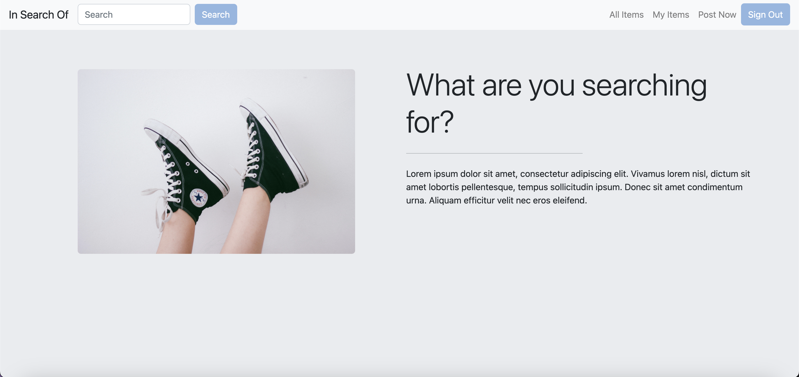
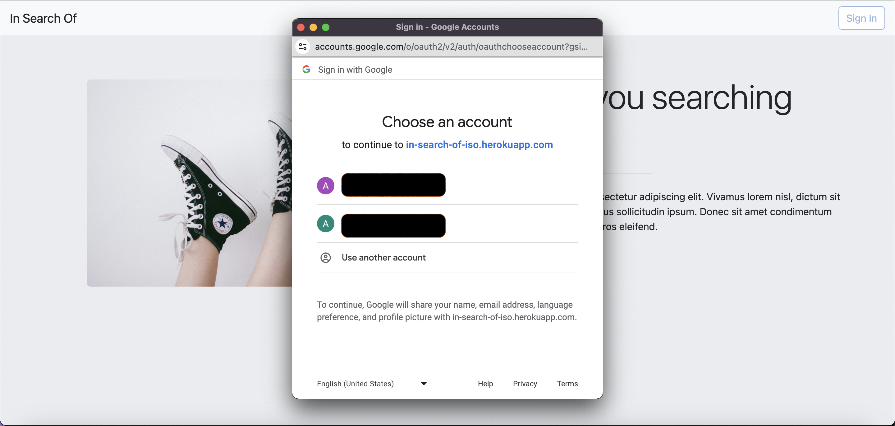
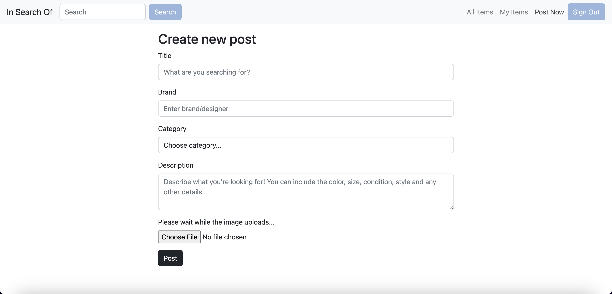
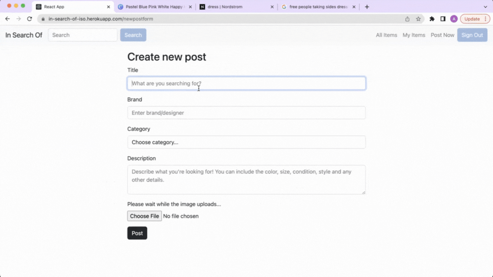
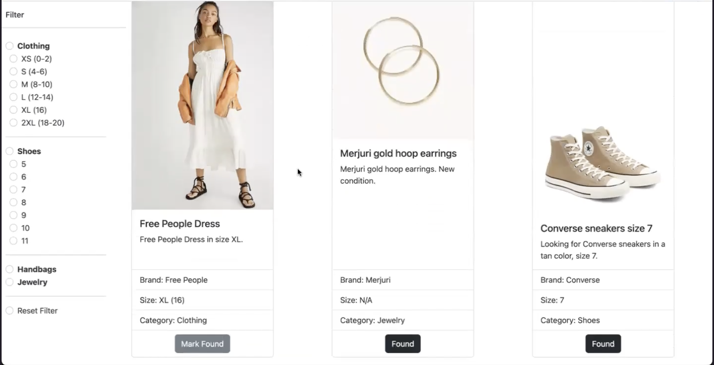
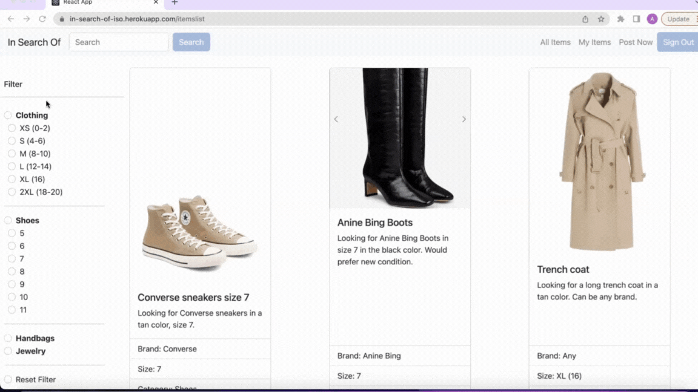

# In Search Of

## Overview
Users can post fashion items they're looking to purchase. If another user has the item that fits the post's specifications, they can email the original poster and make a deal.

The front end of this app was written in React as a capstone project at [Ada Developers Academy](https://adadevelopersacademy.org/).

##  App Features

* Users can log in with their Google account

* Users can post fashion item they're looking for
  * For each post a title, brand, category, size, description and picture can be added

* Each post has the posting user's email so they can be contacted
* When logged in, users can see all of their items they posted. If the user finds the item they're looking for, they can mark their item as "Found"

* Users can search posts by title. 

* Users can filter the search results, their own items and all items by category or size.

## Installation
* Clone this repository
* Install the dependencies by running `yarn install`
* Clone the [back end](https://github.com/ariastroud/back-end-in-search-of) and follow the instructions on that README
* Start the app by `yarn start`   